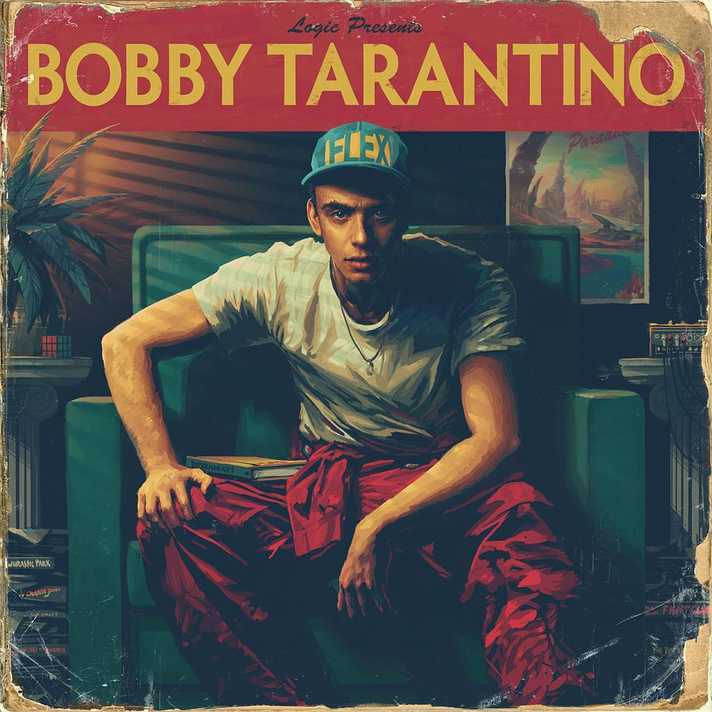
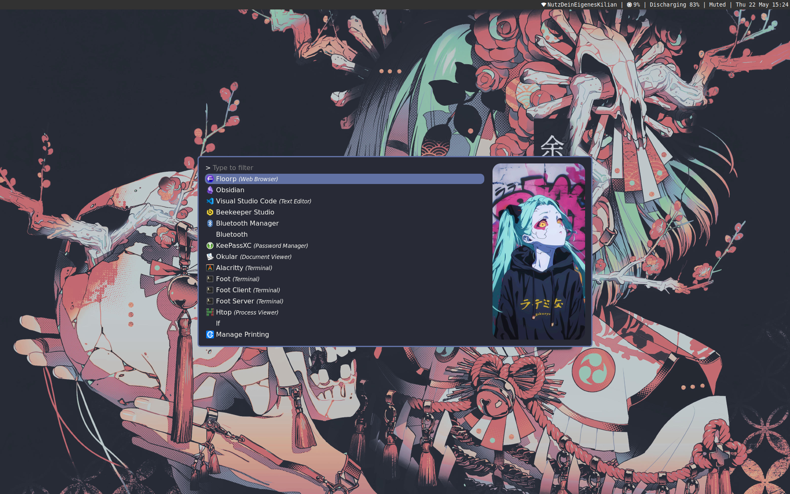
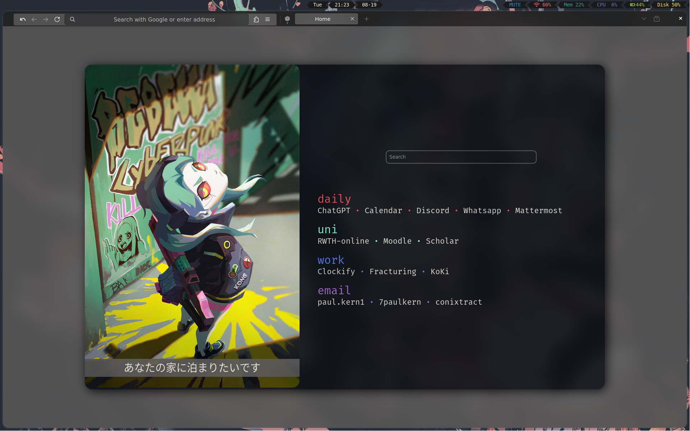
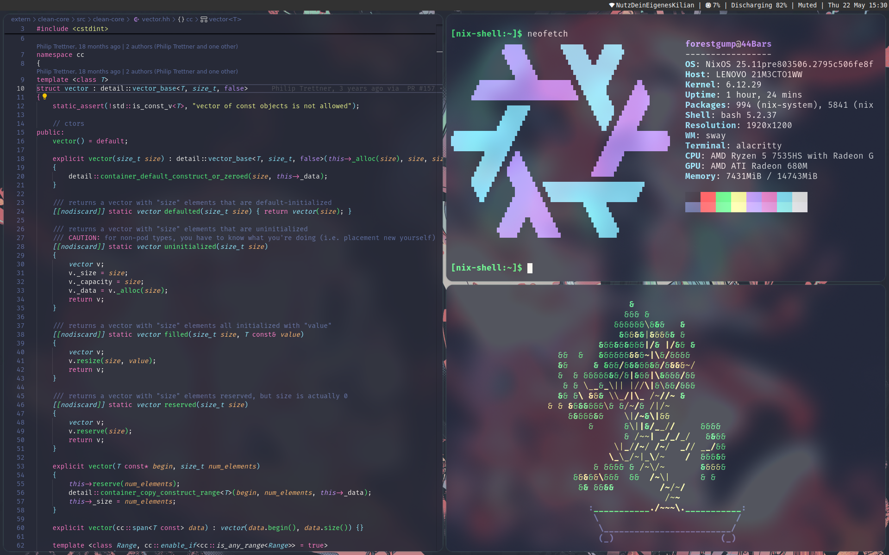

<div align="center">
  <h1> 44Bars </h1>
</div>
<div align="center">




</div>

## Nix
```
home/
    forestgump/
        config/
        home.nix
        ...
hosts/
    44Bars/
        hardware-configuration.nix
        configuration.nix
    ...
```
This is the general structure of my dotfiles.

1. hosts/
- contains machine specific configurations
- `44Bars` contains the configurations for my current laptop

1. home/
- contains home-manager(user specific) configurations and resources

## Screenshots
| <b>Launch Menu</b>                                                                       |
| ---------------------------------------------------------------------------------------- |
| <a href="#--------"></a> |

|                                         <b></b>                                          |                                            <b></b>                                             |
| :--------------------------------------------------------------------------------------: | :--------------------------------------------------------------------------------------------: |
| <a href="#--------"></a> | <a href="#--------"></a> |

## Installation
Don't

just ... just don't

## To-DO

- [ ] setup global color files
- [ ] wallpaper changer (rofi script like https://github.com/develcooking/hyprland-dotfiles/blob/main/.config/rofi/wallpaper-launcher.sh) or wall-d
